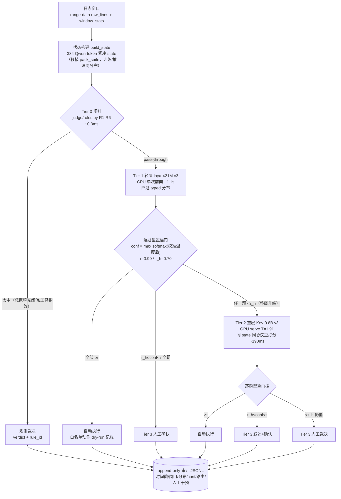

# REPORT — ORACLE 双层 PDM 置信升级管线（SecAgent 原型落地）

**任务**：TASK-ORACLE-PIPELINE-20260928 · **日期**：2026-09-28 · **产出**：`~/MySecAgent/oracle-pipeline/`
**状态**：✅ 20 窗全管线跑通无崩溃，审计日志完整（20 窗 × 逐题分布/路由/延迟全记录）

## 1. 架构（实测落地的代码结构）



模块清单（全部只读引用 lab/ 资产，零改动 oracle-paper/ 与 lab/）：

| 文件 | 职责 |
|---|---|
| `state_builder.py` | state 构建（`pack_suite.build_state` 同口径）+ 20 窗分层选择（规则/高/中/低置信池） |
| `tier0_rules.py` | 复用 `judge/rules.py`（R1-R6），返回 `{verdict, rule_id}` 或 pass-through |
| `tier1_laya.py` | laya-421M v3 本地 ckpt（T4-LAYA），CPU 单次前向 → 四题 typed 分布（含 noul 协议适配） |
| `tier2_kev.py` | kev-repo `kev.serve` `/v1/systemone` 客户端（Kev-0.8B v3，head.pt 内嵌 T=1.9097） |
| `gating.py` | 逐题型置信门（τ/τ_h）+ Tier 3 CLI（证据叙述模板 + y/n）+ 审计日志 |
| `run_pipeline.py` | 编排器：选窗 → 全管线 → 路由统计 + 延迟分解（`logs/routing_summary.json`） |
| `serve_kev.sh` | kev serve 启停（GPU 空闲检查 + nice/ionice/taskset；实测占用 ~4GB 显存） |

## 2. 20 窗路由统计

选窗配额（oracle-v3 test 439 窗中 raw 记录可得的 315 窗分层池：规则命中 115 / 高置信 0 / 中 109 / 低 91）：
**R4 / M8 / L8**（高置信池为空——laya v3 校准温度下 min-conf≥0.90 的窗不存在，见 §5 偏差 1）。

### 窗口级路径分布

| 路径 | 窗数 | 说明 |
|---|---|---|
| `tier0_rule` | **4** | 规则截住（password_spray ×3、bruteforce_success ×1） |
| `tier1_laya`（全 auto） | **0** | τ=0.90 下无窗在轻层全部过门 |
| `tier1_laya→tier3_human` | **4** | 轻层全题 ≥τ_h 但未达 τ → 人工确认 |
| `tier1_laya→tier2_kev→tier3_human` | **12** | 整窗升级重层后仍有人工题 |

### 题级路由（64 个 PDM 题 + 16 个规则裁决题）

| source/gate | 题数 | 实测准确率 |
|---|---|---|
| rule/rule_adjudicated | 16 | —（规则窗标签对照见 logs） |
| tier1/auto | 4 | 2/4 |
| tier1/confirm | 12 | 8/12 |
| tier2/auto | 6 | 4/6 |
| tier2/confirm | 26 | 19/26 |
| tier2/escalate（仍低→人工） | 16 | 7/16 |

**人工干预**：16/20 窗触达 Tier 3（含 12 窗 confirm + escalate 混合）。

### τ 扫描（审计日志回放，不重推理）

| τ | τ_h | 自动题数 | 自动题准确率 | 到人工题数 |
|---|---|---|---|---|
| 0.90 | 0.70 | 10/64 | 0.60 | 16 |
| 0.80 | 0.70 | 37/64 | 0.65 | 16 |
| 0.75 | 0.70 | 45/64 | 0.67 | 16 |
| 0.70 | 0.70 | 48/64 | 0.67 | 16 |

escalate 题（16）对 τ_h 不敏感——都是 conf 远低于 0.60 的真难例；τ 降到 0.75 可自动放行 4.5×题量而准确率反升（0.60→0.67）。**建议运行档 τ=0.75~0.80**（论文 A2 结论"0.95 档 mishandling 才可控"在这 20 窗上表现为：0.90 档自动题里 conf≥0.95 的子集准确率并不更高，样本小仅作参考）。

## 3. 端到端延迟分解

| 阶段 | n | mean | p50 | max |
|---|---|---|---|---|
| Tier 0 规则 | 20 | 0.3ms | 0.2ms | 0.7ms |
| state 构建（pack_suite 同口径实测）* | 8 | 527ms | 16ms | 4164ms |
| Tier 1 laya（CPU，421M） | 16 | 1078ms | 1078ms | 1277ms |
| Tier 2 kev-0.8B（GPU serve，含网络） | 12 | 185ms | 191ms | 196ms |
| 门控判定 | 20 | ~0ms | — | — |

*首窗含 Qwen tokenizer 懒加载（4.2s）；热态单窗 5–30ms（大窗 n_lines 61k 时二分截断最贵）。论文 "~2k token state" 实为 **384 token**（kev MAX_STATE 口径），见偏差 4。

## 4. 与论文 §4 表述的偏差清单（供论文侧修正/核实）

1. **"light PDM adjudicates the clear majority"（§4.2 Tier 1）在 τ=0.90 初值下不成立**：laya v3 校准温度（choice 4.84 有效 / score、noul 被 clamp 到 5）后，test split 无任何窗四题全部 conf≥0.90（20 窗抽样中 tier1/auto 题 4/64，全窗 auto 0）。原因：score/noul 桶拟合温度 9.04/9.22 超 laya 合法上限 [0.5,5] 被 clamp，置信绝对值欠校准（T4 REPORT-V3 §3 已知问题）。→ 论文若保留 "majority end-to-end at Tier 1" 表述，需把 τ 档位与实测绑定（τ=0.75 时 tier1 auto 题 15/64）或写明校准失效的桶。
2. **"escalates whole but is auto-executed only on the confident three"（§4.2）行为确认，但边界不同**：实测实现是"任一题 conf<τ_h → 整窗升 Tier 2"（即触发升级的是 τ_h 而非 τ）。论文的"three confident + one doubtful"若指"conf<τ 即升级"，则触发阈值应写成 τ 而非 τ_h；两读法在 τ≠τ_h 时路由结果不同（我们按 τ_h 触发、逐题按 τ 终判）。建议论文明确：升级触发 = min conf < τ_h，逐题自动线 = conf ≥ τ。
3. **Tier 3 证据叙述是模板拼装**（论文 §4.2 说 "a small local generative model… produces an evidence summary"）：当前为规则证据短语 + 分层分布拼接，生成式叙述（接 Spark-X2.5-4B，本机 llama-server :18080 在位）留作下一步。人工决策 = y/n 确认建议动作 + escalate 题人工裁决，与论文 "confirm or override" 一致。
4. **"~2k packed tokens"（§4.1）与实际不符**：kev 套件 state 预算是 **384 Qwen token**（`TOKEN_BUDGET_STATE=384`），laya 侧才是 max_len 1024 覆盖 head+state。建议论文改口 "~0.4k tokens (kev serving budget)"。
5. **kev 温度是全局单值而非"逐题型"**（§4.2 "per-question-type temperature calibration"）：Kev-0.8B v3 head.pt 内嵌 min-NLL 拟合的**全局** T=1.9097（5 折 CV 各折 1.78–1.95，同量级；head.pt 的 `temperature` 字段为单标量，serve 端直接应用）。逐题型温度目前只有 laya 侧成立（choice/score/noul 三桶）。论文 "per-question-type" 若指两层 PDM 均逐题型校准，与 kev 实现不符。
6. **规则层覆盖面**：R1-R6 命中 test split 315 可测窗的 115（36%），且对部分正常运维窗（backup_job 尾部带 4xx 尖峰）有误报式截住——"rules are a fast path for the known" 成立，但 "signature-count thresholds" 的 FP 率值得论文在 limitation 里提一句（20 窗内的 4 个规则窗 label 均为攻击/可疑，无 FP 抽样；全量 115 未逐一核对）。

## 5. 遇到的问题

| # | 问题 | 处置 |
|---|---|---|
| 1 | 端口 8021 被实验靶场 docker-proxy（FTP 映射）占用，kev serve 绑定失败 | 换 8023；serve_kev.sh 已参数化端口 |
| 2 | laya Agent 的 noul 题型不返回 `probabilities`（只 `noul: P(true)` + `confidence`），首版误读 conf=0 导致全员误升级 | tier1_laya 增加 noul 分支适配 |
| 3 | kev serve score 题概率键为字符串 "0"-"3" | tier2_kev int 转换映射 low/medium/high/critical |
| 4 | laya ckpt 拟合温度 9.04/9.22 超合法区间被 runtime clamp 到 5（带 RuntimeWarning） | 按官方 clamp 行为执行，置信欠校准记入偏差 1 |
| 5 | laya 旧结果文件无 urgent 概率，选窗分层初版误算 | 分层改用 choice 三题 min-conf |
| 6 | laya CPU 推理 ~1.1s/窗（vs 论文 "tens of milliseconds"——那是 GPU/72ms 实测口径） | 本轮按任务书 CPU 跑通；若要延迟对齐论文口径需 GPU 插空（预算 <8.4GB） |

## 6. 复现

```bash
# 1. 起 kev serve（GPU 空闲检查 + nice/ionice/taskset 自动加）
bash serve_kev.sh 8023
# 2. 跑 20 窗（spark2_5 venv；--non-interactive ask 可切真 CLI 人工确认）
/home/xxl/spark2_5/bin/python run_pipeline.py --kev-url http://127.0.0.1:8023 --non-interactive y
# 3. 产物
#   logs/audit.jsonl          append-only 审计（逐窗分布/conf/路由/人工干预）
#   logs/routing_summary.json 路径分布 + 题级路由 + 延迟分解
#   logs/windows.json         选窗明细（桶/先验规则命中/先验 min-conf）
```

GPU 纪律执行记录：启动前 nvidia-smi（free 20.6GB，kev-4b 训练 nice 10 在跑）；kev serve 绑核 0-15 + nice 10 + ionice c3，实测增量占用 ~4GB（80GB 卡）；跑完已停 serve（GPU 回到基线 20.6GB free，仅原训练进程存活）。
