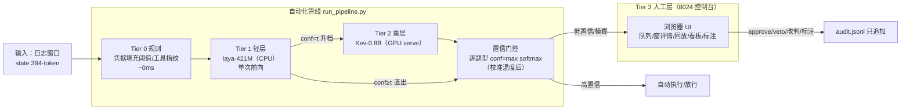
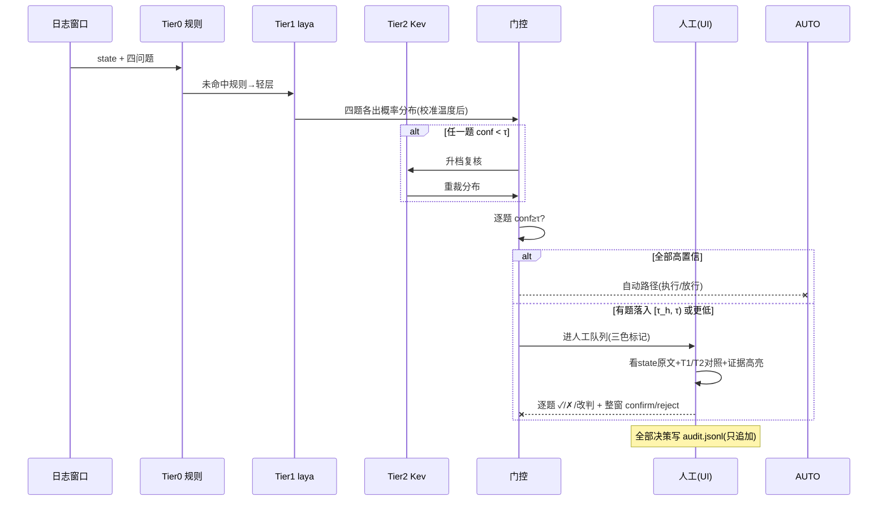
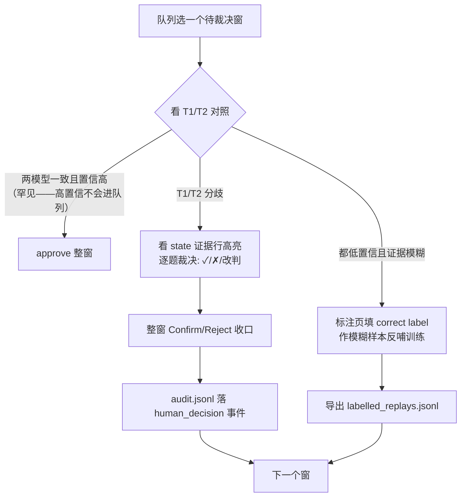

# PDMSecAgent 原型系统使用指南（Tier-3 Console UI）

- 日期：2026-09-29 · 对象：`oracle-pipeline/`（双层 PDM 置信升级管线 + Tier-3 人工控制台）
- 读者：演示/实验操作者。覆盖：**输入什么数据、系统怎么处理、输出什么结果、人工怎么处理**
- 依据：oracle-pipeline README/REPORT 实测记录（P0×5+P1×2 全过，M1-M4 验收通过）

---

## 1. 系统一览



**四层分工**：Tier 0 规则毫秒级拦截已知模式 → Tier 1 轻模型 CPU 快筛 → Tier 2 重模型 GPU 复核 → Tier 3 人工只看机器不确定的少数窗。

## 2. 输入：给系统什么数据

### 2.1 管线输入（run_pipeline.py）

| 输入 | 内容 | 来源 |
|---|---|---|
| **日志窗口集** | 每窗 = 384-token 的 state 文本（SSH/web 等靶场日志关键行）+ 四个类型化问题（tactic 11 选/severity 4 选/action 8 选/urgent） | `logs/windows.json`（切窗器产出，或 oracle suite jsonl） |
| 模型服务 | Tier 1 laya（CPU 本地）；Tier 2 kev-0.8B serve（GPU 按需起） | ~/Mylocllm/ 各手册 |
| 阈值 | τ（自动线）/ τ_h（人工下限），初始 0.90/0.60 | config/参数 |

启动：
```bash
cd ~/MySecAgent/oracle-pipeline
python3 run_pipeline.py          # 批处理跑完产出 logs/audit.jsonl + logs/windows.json
```

### 2.2 UI 输入（server.py）

数据前置：`../logs/audit.jsonl` 与 `../logs/windows.json`（管线产物）。

```bash
cd ~/MySecAgent/oracle-pipeline/ui
python3 server.py                # http://127.0.0.1:8024/
```

浏览器打开即用（无构建、零 CDN 依赖、内网断网可用）。依赖 fastapi/uvicorn/sse-starlette（系统 python 已装）。

## 3. 处理流程（一个窗的完整旅程）



**置信着色规则**（队列视图）：逐题 conf ≥τ 绿 / [τ_h, τ) 黄 / <τ_h 红。

## 4. 输出：系统产出什么

| 输出 | 位置 | 内容 |
|---|---|---|
| **审计日志** | `logs/audit.jsonl` | 每窗完整决策链（State→Tier0→1→2→门控→人工，每步延迟与输出）。**只追加不修改（红线）** |
| 路由统计 | audit 内事件 | 五路分布（tier1_auto/tier2_auto/human/…） |
| **人工决策快照** | `ui/decisions/<window_id>.json` | 逐题 approve/veto/改判结果 |
| **标注导出** | `ui/labelled_replays.jsonl` | 模糊窗 correct label，训练脚本可读格式（state/questions(type,label)/pipeline_final/tier1_dists/tier2_dists/ambiguous） |
| 阈值配置 | `ui/ui_runtime.json` | 当前 τ/τ_h（滑块可改） |

## 5. 人工怎么处理：五个页面操作指南

### 5.1 队列页——决定先看哪个

列出所有待人工裁决的窗：window_id/场景/来源/路由路径/逐题三色置信。**优先处理红色多（低置信）与 severity 为 critical/high 的窗**。已决策/待裁决状态一目了然。

### 5.2 窗详情页——核心工作区

1. 读 **state 原文**（384 token 日志窗口，证据关键行已高亮）；
2. 看 **T1 vs T2 逐题对照**：每题两个模型的选项+温度校准后置信+门控结果——分歧题就是你要裁决的题；
3. 操作：**逐题 ✓（approve）/ ✗（veto）/ 改判**（tactic 11 选、severity 4 选、action 8 选下拉）；
4. **整窗 Confirm / Reject** 收口 → 写入 audit（SSE 即时推送确认 toast）。

### 5.3 回放页——审计与复盘

任一窗的决策链时间线：State→Tier0→Tier1→Tier2→门控→人工，**每步延迟与输出**全部展开。用于：事后审计（"这个窗为什么自动执行了"）、论文案例回放（如 sshbrute-0008：轻层 tactic 对但置信 0.161 → 重层 53ms 重裁 0.932 自动执行）。

### 5.4 看板页——调参与监控

- 路由路径分布（自动化率/人工率一眼看出）；
- 逐题路由计数；
- **τ/τ_h 滑块**：拖动先预览路由变化（τ 0.90→0.85 时人工窗 4→9 之类），确认后"应用"写配置——回放立即按新阈值重门控；
- 延迟分解 P50 直方图（state/tier0/tier1/tier2/gate/human 各段）。

### 5.5 标注页——反哺训练

对模糊窗填 correct label → 导出 labelled_replays.jsonl → 作为回放反馈实证物进 D 系列训练数据。这是"人工注意力变成训练数据"的通道。

### 5.6 人工操作决策树



## 6. 典型场景示例

**场景：sqli 攻击窗进入队列**
1. 队列页：该窗 tactic 绿（0.93）、severity 黄（0.72）、action 红（0.55）→ 打开窗详情；
2. 详情页：T1 判 action=block_ip（conf 0.55），T2 重裁 action=quarantine（conf 0.71）——分歧；
3. 看 state 原文高亮的 SQL 注入 payload 行，人工判断 quarantine 过重 → 改判 monitor；
4. 其余三题 ✓，整窗 Confirm → audit 落 human_decision，队列中该窗转已决策。

## 7. 红线与注意事项

1. **audit.jsonl 只追加不修改**——所有 UI 决策以新事件类型写入，历史不可篡改（审计要求）；
2. **决策不回灌正在运行的管线**（管线批处理式跑完即退）；决策作用于回放视图与后续训练数据，不改变已跑完的结果；
3. UI 决策转发到在线管线属后续工作（run_pipeline 增设 decisions/ 读取的会话模式）；
4. 单机内网原型：无密码保护/多会话（P2 后置），绑定 127.0.0.1；
5. τ/τ_h 修改有审计（threshold_change 事件），调参历史可回放。

## 8. 常见问题

| 问题 | 处理 |
|---|---|
| 队列空 | 检查 audit.jsonl 是否存在（管线没跑）；或当前 τ 下全部自动路径处理完（好事） |
| 窗详情打不开 | window_id 需与 windows.json 一致；查 /api/window/{id} 返回 |
| τ 滑块没生效 | "预览"只算不改；要点"应用"写 ui_runtime.json |
| 英文版 | 打开 `/en.html`（论文截图用英文版） |
| API 文档 | `/api/docs`（FastAPI 交互式文档） |
